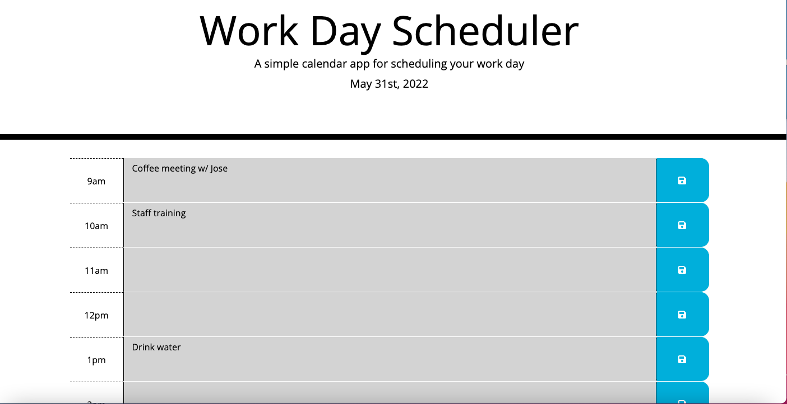

This application features a daily planner to help schedule the work day. It is easy to use, with color coded blocks of time that immediately points the user to the present hour (red) and what lies ahead (green). It also greyblocks the timeslots that have already passed. This thoughtful interface helps the user to optimize their time and easily manage a busy schedule.

The user is able to input tasks, reminders, and to-dos into the appropriate hour and save them. These items persist even if the page is refreshed.

The current date is displayed in a banner across the top of the application. And the present time, while not displayed outright, is also an important figure in building this application. These time components are highly accurate and powered by moment.js.

Link to deployed application: https://tracyroseguajardo.github.io/daily-planner/

Screenshot of application: 
